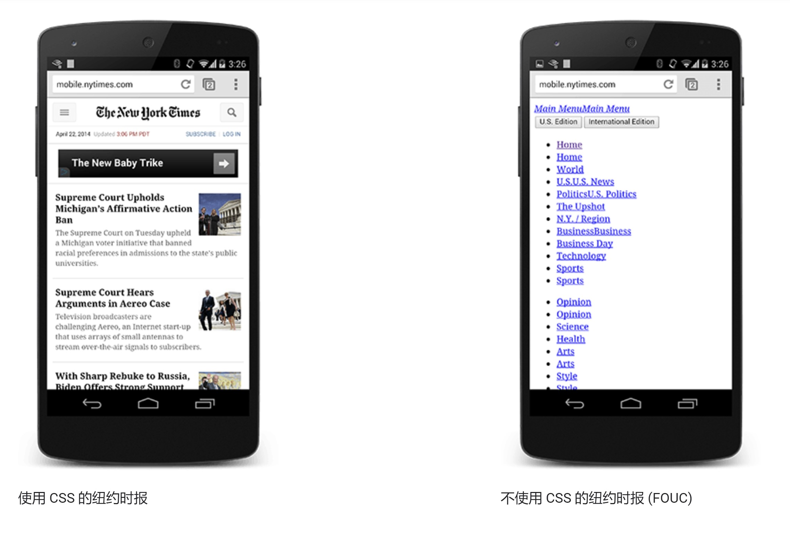
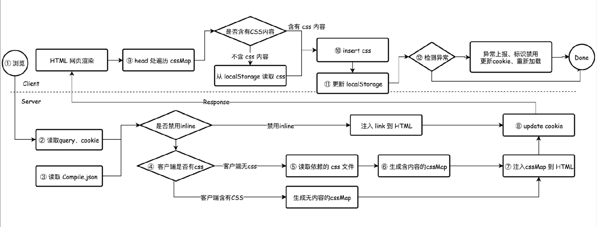
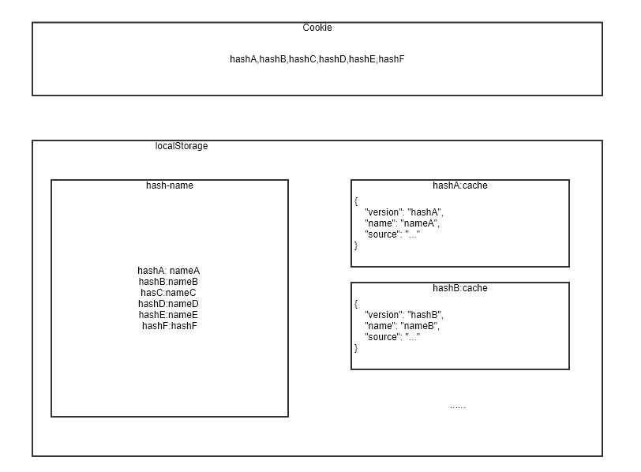

# 前端性能优化 —— 内联关键样式 + 缓存

关键词

1. 内联
2. 关键样式
3. 缓存

## 为什么应该内联关键样式

参考文献

- [如何以及为什么应该内联关键 CSS](https://www.zcfy.cc/article/how-and-why-you-should-inline-your-critical-css)
- [渲染树构建、布局及绘制](https://developers.google.com/web/fundamentals/performance/critical-rendering-path/render-tree-construction)

### [阻塞渲染的 CSS](https://developers.google.com/web/fundamentals/performance/critical-rendering-path/render-blocking-css)

**思考：为什么我们通常都要把 CSS 放在 HTML 的 head 标签里，放在 body 标签里不行吗？**



上图展示了纽约时报网站使用和不使用 CSS 的显示效果，没有 CSS 的网页实际上无法使用。如果浏览器不等待 CSSOM 准备就绪就直接渲染无样式的网页，那么在 CSSOM 就绪后页面会突然变成左侧的样式，这种情况通常称为“无样式闪烁”(FOUC)。为了避免这种问题，我们通常都会把样式放在 head 标签里，浏览器会阻塞渲染，直至 DOM 和 CSSOM 全部准备就绪。

示例：

1. [css-block-render1.html](./examples/css-block-render1.html)：测试 FOUC
1. [css-block-render2.html](./examples/css-block-render2.html)：测试阻塞渲染

总结：两个知识点

1. 浏览器遇到样式标签时，会阻塞后续内容的渲染（之前的正常渲染），直至浏览器下载解析并构建好 CSSOM（之前渲染的内容会按新样式重新布局和绘制）；
2. 我们通常都要把 CSS 放在 HTML 的 head 标签里，以避免 FOUC 问题，所以样式阻塞渲染是不可避免的；

### 阻塞渲染带来的问题

**思考：既然 CSS 阻塞渲染是必须的，我们还可以做哪些优化呢？**

1. 阻塞渲染的 CSS 通常都以外链形式引用，需要等待 HTML 下载好后才能开始加载，这里会浪费不少时间，对首屏渲染影响较大；
2. 阻塞渲染的 CSS 通常都包含了所有的样式代码，对于首屏渲染来说，我们需要的样式通常是很小的，这些不重要的样式代码会拖慢我们的首屏时间。

**解决方案**

1. HTTP2
2. 内联关键样式

## 实现方案

### 提取关键样式

关键样式对应的中文资料较少，其对应的应为名称为 critical，通过这个关键词可以找到更多相关的博文和开源库。但实际使用起来限制较多，结果并不理想 —— 很多都是依赖于最终实际渲染的 HTML，这对于我们动态生成的网页，并不是很适合。

- [addyosmani/critical](https://github.com/addyosmani/critical) - Extract & Inline Critical-path CSS in HTML pages.
- [GoogleChromeLabs/critters](https://github.com/GoogleChromeLabs/critters) - A Webpack plugin to inline your critical CSS and lazy-load the rest.
- [pocketjoso/penthouse](https://github.com/pocketjoso/penthouse)
- [anthonygore/html-critical-webpack-plugin](https://github.com/anthonygore/html-critical-webpack-plugin) - A webpack plugin that will extract critical CSS. Now supports Webpack v4.
- [lukeed/webpack-critical](https://github.com/lukeed/webpack-critical) - Extracts & inlines Critical CSS with Wepack
- [nrwl/webpack-plugin-critical](https://github.com/nrwl/webpack-plugin-critical) - Webpack wrapper for @addyosmani's critical library.
- [anthonygore/html-critical-webpack-plugin](https://github.com/anthonygore/html-critical-webpack-plugin) - A webpack plugin that will extract critical CSS. Now supports Webpack v4.
- [stereobooster/react-snap](https://github.com/stereobooster/react-snap) - Zero-configuration framework-agnostic static prerendering for SPAs.

ps：非关键样式可以使用 [loadCSS](https://github.com/filamentgroup/loadCSS/) 这样的库，实现无阻塞地加载非关键样式。

### 内联样式

```js
var style = document.createElement('style');
style.innerHTML = '...'; // 服务端下发的 CSS 样式字符串
document.head.appendChild(style);
```

坑点：在注入到 HTML 时，需要替换反斜杠为两个反斜杠。

```css
.xxx:after { content: "\abcd" }
```

```html
<script>
    var css = '.xxx:after { content: "\\abcd" }'; 
</script>
```

### 实现缓存



### 缓存限制

**思考：看整个流程下来是不是没有复杂的地方，更多的时逻辑判断？**

1. Cookie 存在存储大小限制，每个 Cookie 最大只能有 4096 Byte；
2. Cookie 缓存数据过多，增大了请求数据量，影响请求速度；
3. localStorage 存在存储大小限制，一般在 10Mb 以内；

**总结：缓存实现最大的限制在于空间限制，我们需要充分利用有限的空间，并处理存储空间不足的情况**

### 内联样式建模

- hash：源码的 hash 值，代表的样式版本
- name：标识，表示属于哪个模块的样式，例如：多页应用是对应路由名称

    如果是 webpack4 使用 splitChunks，webpack 自动会帮我们按 entry 命名号打包名称，例如：每个 entry 对应的是 xxx.css，多个 entry 公共的样式拆包后的名称是，xxx1_xxx2_xxx3.css

- source：源码，CSS 样式代码

### 缓存管理机制



1. Cookie 存储空间较为有限，我们需要尽量节省每一个字符，前面的内联样式模型中提到了每个样式包含 hash、name、source，其中 hash 值可以唯一标识出某个模块的某个版本样式，所以只存储 hash 值时最优的方案。而服务端只要判断 cookie 中是否有包含对应的 hash 值就可以知道是否要下发对应的 CSS 样式代码。

    Cookie 样式 hash 值的存储按时间从头到尾递减，最新的样式 hash 值存在 cookie 值的开头，在空间不足时可以直接截断 Cookie 样式缓存的 hash 值来处理

2. 如果 Cookie 里只存取 hash 值的话，随着项目版本的迭代，Cookie 里存储的 hash 值会越来越多，早晚会超出 4K Byte 的限制。当然，你可以截断超出 4K Byte 之后的 hash 值。但是，这样存取效率不高，里面有很多模块不同版本的 hash 值，我们通常只关心最新的版本的 hash 只。而我们项目的模块通常不会有太多的变化，如果 Cookie 只存取每个模块唯一一个 hash 值，一般都不会超出 4K 限制。例如：hash 值采用 webpack 的 contenthash:8 的话，我们可以存取 500 个左右的模块（页面）样式。所以，为了去重 hash 值，我们在 localStorage 里存储了 hash 值对应的模块标识名。
3. 在存储源码时，我们采用了每个 hash 值对应一个 localStorage key 值，对应 value 为内联样式模块的 JSON 值。

    这么做，主要是为了提高缓存的读写效率  —— 一个域名下往往存取了各个页面或模块的样式，而某个页面或模块只关心自己页面或模块的样式，所以按 hash 值存储各自的内联样式模型更加合理。

**处理存储空间不足**

1. 在存储大于 4KB 的 Cookie 时，浏览器会忽略该操作，不做任何处理，也没有任何异常抛出；
2. localStorage 在存储超出空间限制时，会抛出 DOMException；

得出上面的调研结果后，我们只需要在 localStorage 存储抛出异常时，按一定的机制从 Cookie 里清理掉旧的 hash 值。同样，对于 Cookie 值，在存储时检测字符长度是否超出 4000，并忽略掉超出部分的 hash 值，但这种情况通常不会存在，除非你的项目页面多大 500 个。

## 实际应用

这种方案对于首次访问的首屏速度提升有较大的帮助，如果是二次访问，因为有 HTTP 缓存，所以对比外链样式速度提升不大。

## 总结

1. 为什么？

    FOUC + CSS 阻塞渲染

2. 怎么做？

    内联 + 关键样式 + 缓存


